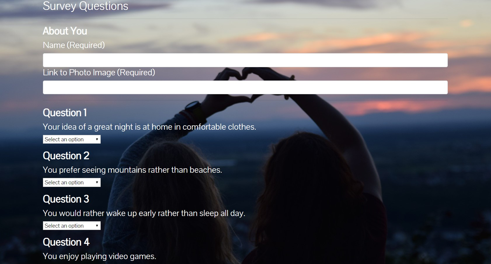

# Friend-Finder

## Overview

To use this app, a user must answer 10 survey questions. The answers range from 1 (Strongly Disagree) and go to 5 (Strongly Agree). Based on the responses the user gives, the app will match them with someone that most closely fits with the answers they gave.

### Link to the application

https://arcane-journey-78495.herokuapp.com/

### Tools used to create Friend Finder

* HTML5
* Bootstrap4
* CSS3
* Javascript
* Jquery
* Express.js
